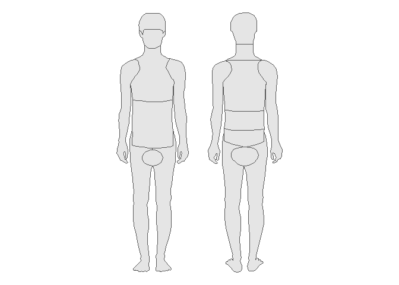

<!-- README.md is generated from README.Rmd. Please edit that file -->

# bodymap

<!-- badges: start -->
<!-- badges: end -->

The goal of bodymap is to make plotting of body-related frequencies or
intensities feasible.

## Installation

You can install the development version of bodymap like so:

``` r
remotes::install_github("benediktclaus/bodymap")
```

## Example

This is a basic example which shows you how to solve a common problem:

``` r
library(bodymap)
library(ggplot2)

base_plot <- ggplot(bodymap) +
    geom_sf()

base_plot +
    theme_void()
```


