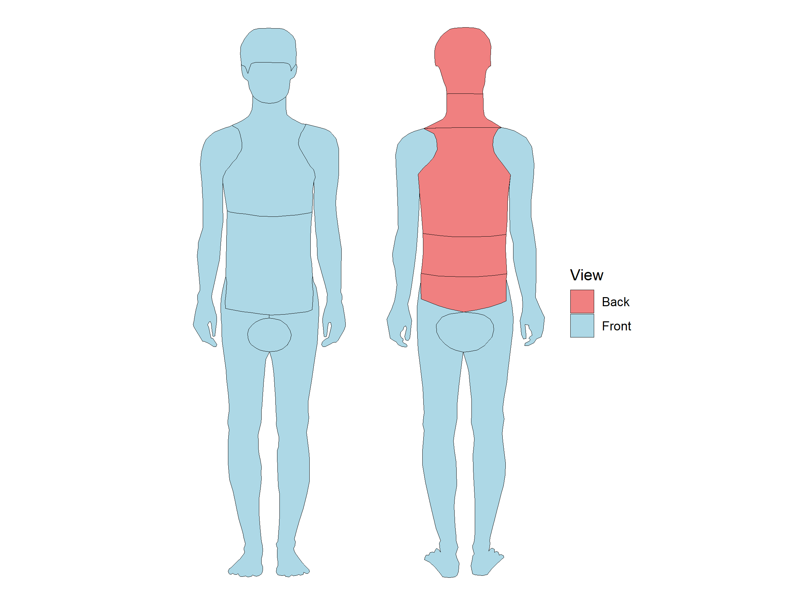

<!-- README.md is generated from README.Rmd. Please edit that file -->

# bodymap 

<!-- badges: start -->

[](https://github.com/benediktclaus/bodymap/actions/workflows/R-CMD-check.yaml)
[](https://lifecycle.r-lib.org/articles/stages.html#experimental)
[](https://www.gnu.org/licenses/gpl-3.0)
<!-- badges: end -->

## Overview

**bodymap** provides a simple and intuitive way to visualize
body-related data in R. Whether you’re mapping symptom frequencies, pain
intensities, or regional distributions in medical research, bodymap
makes it easy to create clear and professional anatomical visualizations
using the familiar `ggplot2` syntax.

### Key Features

- 📊 **Ready-to-use body region dataset** with 14 anatomical regions
- 🎨 **Seamless ggplot2 integration** via `geom_sf()`
- 🔍 **Detailed anatomical coverage** including front/back views and
  spinal subdivisions
- 🏥 **Perfect for medical visualizations** such as symptom mapping,
  pain distribution, or injury patterns
- 📦 **Lightweight**: No functions, just clean spatial data

## Installation

### From GitHub

You can install the development version of bodymap from GitHub:

``` r
# install.packages("pak")
pak::pak("benediktclaus/bodymap")
```

### From R-universe

Or install from my R-universe repository:

``` r
# Enable repository
options(repos = c(
  benediktclaus = 'https://benediktclaus.r-universe.dev',
  CRAN = 'https://cloud.r-project.org'
))

# Install bodymap
install.packages('bodymap')
```

## Quick Start

``` r
library(bodymap)
library(ggplot2)

# Create a simple body map visualization
ggplot(bodymap) +
  geom_sf(fill = "lightblue", color = "black") +
  theme_void()
```


## Examples

### Distinguish Between Front and Back Views

``` r
library(dplyr)
#> 
#> Attache Paket: 'dplyr'
#> Die folgenden Objekte sind maskiert von 'package:stats':
#> 
#>     filter, lag
#> Die folgenden Objekte sind maskiert von 'package:base':
#> 
#>     intersect, setdiff, setequal, union

bodymap |>
  mutate(view = ifelse(id >= 2000, "Back", "Front")) |>
  ggplot() +
  geom_sf(aes(fill = view), color = "black") +
  scale_fill_manual(values = c("Front" = "lightblue", "Back" = "lightcoral")) +
  labs(fill = "View") +
  theme_void()
```



### Highlight Spinal Regions

``` r
library(rcartocolor)

ggplot(bodymap) +
  geom_sf(aes(fill = SUBREGION), color = "black") +
  scale_fill_carto_d(palette = "Safe", na.value = "grey90") +
  labs(fill = "Spinal Region") +
  theme_void()
```


### Map Pain Intensity Data

``` r
# Create example pain data
pain_data <- data.frame(
  id = c(1010, 1030, 2051, 2052, 1040),
  intensity = c(0.7, 0.9, 0.6, 0.8, 0.4)
)

# Join with bodymap and visualize
bodymap |>
  left_join(pain_data, by = "id") |>
  ggplot() +
  geom_sf(aes(fill = intensity), color = "black") +
  scale_fill_carto_c(palette = "OrYel", na.value = "grey95", limits = c(0, 1)) +
  labs(fill = "Pain Intensity") +
  theme_void()
```


### Aggregate by Region Name

When you want to map the same value to all instances of a region (e.g.,
all “Back” subdivisions):

``` r
# Symptom frequencies by region name
symptom_by_name <- data.frame(
  NAME = c("Head", "Chest", "Back"),
  frequency = c(0.8, 0.6, 0.5)
)

bodymap |>
  left_join(symptom_by_name, by = "NAME") |>
  ggplot() +
  geom_sf(aes(fill = frequency), color = "black") +
  scale_fill_carto_c(palette = "Purp", na.value = "grey95") +
  labs(fill = "Frequency") +
  theme_void()
```


## Dataset Structure

The `bodymap` dataset contains 14 body region polygons with the
following variables:

- **id**: Unique identifier (10xx = front, 20xx = back)
- **NAME**: Body region name (Head, Face, Chest, Belly, Back,
  Upper/Lower Limbs, Genitals)
- **SUBREGION**: Spinal subdivisions (Cervical, Thoracic, Lumbar,
  Sacrum) where applicable
- **geometry**: Spatial multipolygon data (sf format)

``` r
bodymap
#> Simple feature collection with 14 features and 3 fields
#> Geometry type: MULTIPOLYGON
#> Dimension:     XY
#> Bounding box:  xmin: 0 ymin: 0 xmax: 95.77512 ymax: 150
#> CRS:           NA
#> First 10 features:
#>      id             NAME SUBREGION                       geometry
#> 1  1010             Head      <NA> MULTIPOLYGON (((19.44389 14...
#> 2  1020             Face      <NA> MULTIPOLYGON (((19.96788 12...
#> 3  1030            Chest      <NA> MULTIPOLYGON (((19.93803 98...
#> 4  1050            Belly      <NA> MULTIPOLYGON (((18.46556 71...
#> 5  2010             Head      <NA> MULTIPOLYGON (((73.42057 13...
#> 6  2050             Back  Cervical MULTIPOLYGON (((73.82409 12...
#> 7  2053             Back    Sacrum MULTIPOLYGON (((62.09445 82...
#> 8  2051             Back  Thoracic MULTIPOLYGON (((85.27642 93...
#> 9  2052             Back    Lumbar MULTIPOLYGON (((85.48763 82...
#> 10 1040 Upper Right Limb      <NA> MULTIPOLYGON (((7.999091 10...
```

## Use Cases

- 🏥 **Clinical research**: Visualize symptom distributions, pain
  patterns, or injury locations
- 📊 **Medical surveys**: Display body-related questionnaire results
- 🔬 **Epidemiology**: Map disease prevalence across body regions
- 💊 **Pharmacology**: Show drug efficacy or side effect locations
- 🏋️ **Sports medicine**: Illustrate injury patterns or training focus
  areas

## Getting Help

If you encounter a bug or have a feature request, please [open an
issue](https://github.com/benediktclaus/bodymap/issues) on GitHub.

## License

This program is free software: you can redistribute it and/or modify it
under the terms of the GNU General Public License as published by the
Free Software Foundation, either version 3 of the License, or (at your
option) any later version.

This program is distributed in the hope that it will be useful, but
WITHOUT ANY WARRANTY; without even the implied warranty of
MERCHANTABILITY or FITNESS FOR A PARTICULAR PURPOSE. See the [GNU
General Public License](https://www.gnu.org/licenses/gpl-3.0.html) for
more details.

## Acknowledgments

Body regions were manually digitized for visualization purposes. This
package builds on the excellent [sf](https://r-spatial.github.io/sf/)
and [ggplot2](https://ggplot2.tidyverse.org/) packages.

------------------------------------------------------------------------

**Author**: Benedikt Claus  
**GitHub**: [@benediktclaus](https://github.com/benediktclaus)
